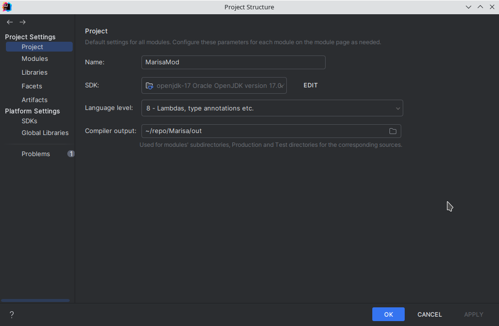

# Contribute

- [Contribute](#contribute)
  - [Setup Project](#setup-project)
    - [Prerequisites](#prerequisites)
  - [Guidelines](#guidelines)
    - [Pull Requests](#pull-requests)
    - [Code Style](#code-style)

## Setup Project

> **Warning** development environment is only tested on linux. may not work for other OS

### Prerequisites

to build and test this mod, you will need to set up these PATHs.
you may have to edit `build.gradle.kts` to match your environment.

1. path to `steamapps` directory
2.

```sh
$homeDir/.local/share/Steam/steamapps
$steamDir/workshop/content/Slay the Spire
```

when building,

```sh
./docs/changelog/changelog.md
./docs/changelog/changelog.bbcode
./docs/changelog/changelog.sts.txt
```


```sh
git clone https://github.com/scarf005/Marisa.git
git clone git@github.com:scarf005/Marisa.git
```



setup java, kotlin, and gradle in your intellij. language version must be 8.

```sh
gradle -t toMods # install once
./gradlew -t toMods --warning-mode all # dev mode: recompile on changes
```

run `./gradle -t move` to copy jar into your steam mods folder.

## Guidelines

### Pull Requests

It is recommended to [create a relevent task][issue-task] before submitting a pull request.

[issue-task]: https://github.com/scarf005/Marisa/issues/new?assignees=&labels=&template=task.yml

### Code Style

1. please follow `.editorconfig`.
2. setting up format on save on intellij is recommended.
