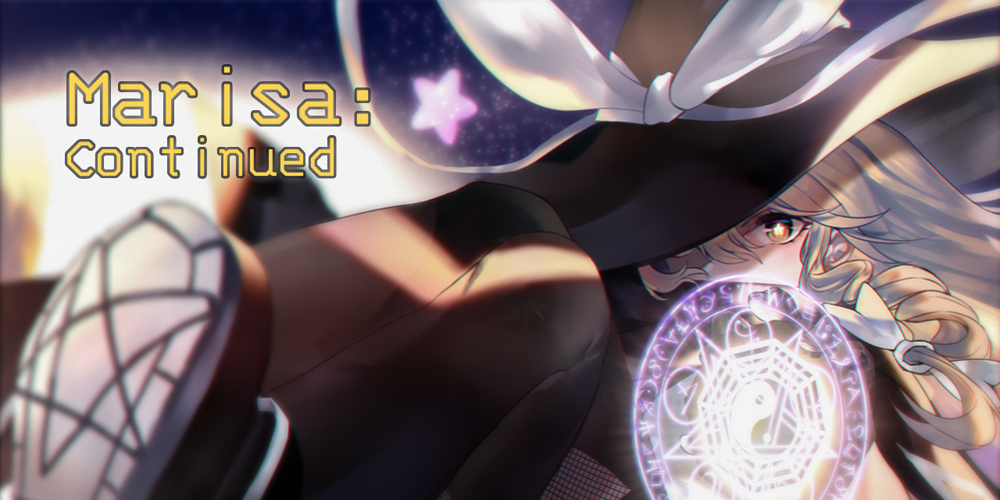

[][workshop]

<div align="center">
  
  
  <a href="https://github.com/scarf005/Marisa/releases/latest">
    
  </a>
  <a href="https://steamcommunity.com/sharedfiles/filedetails/?id=2902980404">
    
  </a>
  <h1>Marisa: Continued</h1>
</div>

a [re-continued][original] mod for [**Slay the Spire**][sts], which adds **[Marisa Kirisame
][marisa]** from Touhou Project as a playable character.

> **Note** _**Marisa:** Continued_ is a fork of [STS_ThMod_MRS][original-github] mod. Credits goes to the original authors.

## New features

### Previews for generated cards

<div align="center">
  
  
  
</div>

## Content and Gameplay

### Charge

- when **Charged Up**, card damage grows up exponentially.

| Charges |  8  | 16  | 24  | 32  |
| :-----: | :-: | :-: | :-: | :-: |
| Damage  | x2  | x4  | x8  | x16 |

- charges can be **stacked up 1** by playing a card.
- there are also cards that gives more charges.
- charges are **depleted** on attack.

### Amplify

- by using extra energy, cards can be **Amplified** to become much stronger.
- some cards will let you not cost energy to Amplify them.

## Usage

### Installation

subscribe [ModTheSpire][modthespire] and [BaseMod][basemod].

[modthespire]: https://steamcommunity.com/sharedfiles/filedetails/?l=koreana&id=1605060445
[basemod]: https://steamcommunity.com/sharedfiles/filedetails/?id=1605833019

#### Subscribe from Steam Workshop

<a href="https://steamcommunity.com/sharedfiles/filedetails/?id=2902980404">
  
</a>

#### Compile from source

> **Warning** development environment is only tested on linux. may not work for other OS

git clone repository `https://github.com/scarf005/Marisa.git`


setup java, kotlin, and gradle in your intellij. language version must be 8.

```sh
gradle -t toMods # install once
./gradlew -t toMods --warning-mode all # dev mode: recompile on changes
```

run gradle task to copy jar into your steam mods folder.

## [Credits][original-credit]

## License

License under [`src/main/kotlin/marisa`](./src/main/kotlin/marisa/):

[MIT](src/main/kotlin/marisa/LICENSE)

[original]: https://steamcommunity.com/sharedfiles/filedetails/?id=1614104912
[original-github]: https://github.com/lf201014/STS_ThMod_MRS
[original-credit]: https://github.com/lf201014/STS_ThMod_MRS#credits
[sts]: https://store.steampowered.com/app/646570/Slay_the_Spire/
[marisa]: https://en.touhouwiki.net/wiki/Kirisame_Marisa
[workshop]: https://steamcommunity.com/sharedfiles/filedetails/?id=2902980404
