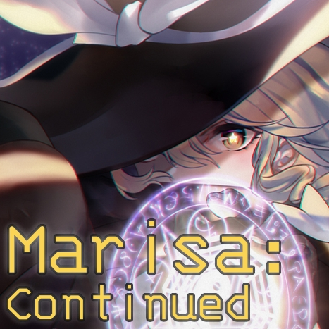

[][workshop]

<div align="center">
  
  
  <a href="https://github.com/scarf005/Marisa/releases/latest">
    
  </a>
  <a href="https://steamcommunity.com/sharedfiles/filedetails/?id=2902980404">
    
  </a>
  <a href="https://steamcommunity.com/sharedfiles/filedetails/?id=2902980404">
    
  </a>
  <h1>Marisa: Continued</h1>
</div>

a [re-continued][original] mod for [**Slay the Spire**][sts], which adds **[Marisa Kirisame][marisa]** from Touhou Project as a playable character.

> [!NOTE]
>
> _**Marisa:** Continued_ is a fork of [STS_ThMod_MRS][original-github] mod. Credits goes to the original authors.

> [!WARNING]
>
> Due to IRL issues, this project is **currently not recieving active maintenance**. While I will review PRs as soon as possible, please note that I may not be able to dedicate much time on this project. Consequently, issues may not be addressed in a timely manner. I apologize for the inconvenience.

## New features

### Better UI for amplifiable cards

https://user-images.githubusercontent.com/54838975/233419957-b16aaee0-948b-4af9-bb73-ddf3d91027b9.mp4

- **cards glow gold** for amplifiable cards.
- **amplified cost** will be shown on the card in **green** color.

### Previews for generated cards

<div align="center">
  
  
  
</div>

## Content and Gameplay

### Charge

- when **Charged Up**, card damage grows up exponentially.

| Charges |  8  | 16  | 24  | 32  |
| :-----: | :-: | :-: | :-: | :-: |
| Damage  | x2  | x4  | x8  | x16 |

- charges can be **stacked up 1** by playing a card.
- there are also cards that gives more charges.
- charges are **depleted** on attack.

### Amplify

- by using extra energy, cards can be **Amplified** to become much stronger.
- some cards will let you not cost energy to Amplify them.

## Usage

### Installation

subscribe [ModTheSpire][modthespire] and [BaseMod][basemod].

[modthespire]: https://steamcommunity.com/sharedfiles/filedetails/?l=koreana&id=1605060445
[basemod]: https://steamcommunity.com/sharedfiles/filedetails/?id=1605833019

#### [Subscribe from Steam Workshop][workshop]

<a href="https://steamcommunity.com/sharedfiles/filedetails/?id=2902980404">
  
</a>

#### Compile from source

> **Warning**
>
> development environment is only tested on linux. may not work for other OS

git clone repository `https://github.com/scarf005/Marisa.git`


setup java, kotlin, and gradle in your intellij. language version must be 8.

```
# fill in your steam directory ending with '/steamapps'
userSteamDir=/home/scarf/.local/share/Steam/steamapps
# default: "$userSteamDir/workshop/content/$gameSteamId"
workshopDir=
```

copy `gradle.properties.example` to `gradle.properties` and provide path to your steam directory.

```sh
gradle changelog # install once
./gradlew -t changelog --warning-mode all # dev mode: recompile on changes
```

run gradle task to copy jar into your steam mods folder.

## [Credits][original-credit]

See [lf201014/STS_ThMod_MRS#credits][original-credit] for details.

## License

- Source code: MIT License
- Resources: CC-BY-NC-SA 4.0.

See [LICENSE](LICENSE) for details.

[original]: https://steamcommunity.com/sharedfiles/filedetails/?id=1614104912
[original-github]: https://github.com/lf201014/STS_ThMod_MRS
[original-credit]: https://github.com/lf201014/STS_ThMod_MRS#credits
[sts]: https://store.steampowered.com/app/646570/Slay_the_Spire/
[marisa]: https://en.touhouwiki.net/wiki/Kirisame_Marisa
[workshop]: https://steamcommunity.com/sharedfiles/filedetails/?id=2902980404
